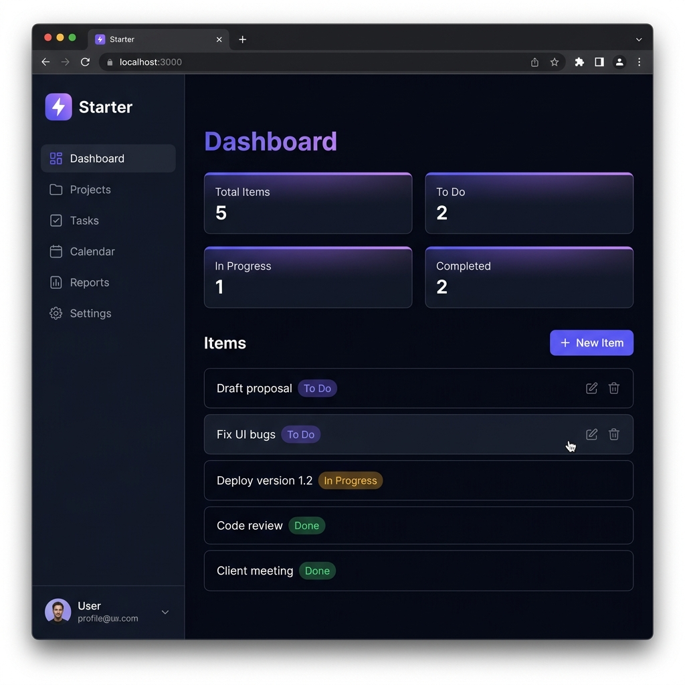

<p align="center">
  
</p>

<h1 align="center">⚡ Fullstack Starter</h1>

<p align="center">
  <strong>Production-ready fullstack starter — Astro SSR + NestJS + Supabase + PostgreSQL + Auth + CRUD + CSRF. TypeScript everywhere.</strong>
</p>

<p align="center">
  
  
  
  
  
  
  
</p>

---

## 🚀 Getting Started

```bash
# 1. Clone the repo
git clone https://github.com/guyboireau/fullstack-starter.git && cd fullstack-starter

# 2. Install all dependencies
npm install

# 3. Configure environment variables
cp .env.example .env   # Then fill in your Supabase credentials

# 4. Start the dev servers
npm run dev
```

> **Frontend** → [http://localhost:4321](http://localhost:4321) &nbsp;|&nbsp; **API** → [http://localhost:3000](http://localhost:3000)

---

## 🏗️ Architecture

```
fullstack-starter/
├── apps/
│   ├── web/          → Astro 6 SSR + Vercel adapter (landing + admin panel)
│   └── api/          → NestJS 11 (REST API)
├── supabase/
│   ├── migrations/   → SQL migrations (profiles, items)
│   └── seed.sql      → Sample data
├── docker-compose.yml
└── .github/workflows/ci.yml
```

**How it works:** The Astro SSR frontend authenticates users via **Supabase Auth** (email/password). Authenticated requests hit the **NestJS API**, which validates JWTs with a custom `SupabaseAuthGuard`. Session-changing forms (login, register, signout, items) are protected by a **CSRF guard** (double-submit cookie pattern) — Bearer-token requests bypass it automatically. All database operations use Supabase's client library with **Row Level Security (RLS)** — each user can only access their own data.

---

## ✨ Features

| Feature | Details |
|---------|---------|
| 🔐 **Authentication** | Login, Register, Logout via Supabase Auth |
| 📝 **CRUD** | Full Create, Read, Update, Delete on Items |
| 🛡️ **Auth Guard** | NestJS guard validates Supabase JWTs |
| 🔒 **Row Level Security** | PostgreSQL RLS — users only see their own data |
| 🔑 **CSRF Protection** | Double-submit cookie on all session-mutating forms; Bearer bypasses |
| 🎨 **Design System** | 8-variant design switcher (A→H) — demo multiple client styles |
| 📊 **Admin Panel** | Astro SSR admin panel (items management, dashboard) |
| ✅ **Validation** | DTOs with `class-validator` on the API |
| 🐳 **Docker Compose** | One-command local dev environment |
| 🔄 **CI/CD** | GitHub Actions: lint + typecheck on every PR |
| 📦 **Monorepo** | npm workspaces — single `npm install` |

---

## 🗄️ Database Schema

### `profiles`
| Column | Type | Description |
|--------|------|-------------|
| `id` | UUID (PK) | References `auth.users` |
| `email` | TEXT | User email |
| `full_name` | TEXT | Display name |
| `avatar_url` | TEXT | Profile picture URL |
| `created_at` | TIMESTAMPTZ | Auto-set |

### `items`
| Column | Type | Description |
|--------|------|-------------|
| `id` | UUID (PK) | Auto-generated |
| `user_id` | UUID (FK) | Owner reference |
| `title` | TEXT | Item title |
| `description` | TEXT | Optional details |
| `status` | TEXT | `todo` \| `in_progress` \| `done` |
| `created_at` | TIMESTAMPTZ | Auto-set |

---

## 🔑 API Endpoints

All endpoints under auth require a `Bearer` token in the `Authorization` header.

| Method | Endpoint | Auth | Description |
|--------|----------|------|-------------|
| `GET` | `/auth/profile` | ✅ | Current user profile |
| `GET` | `/users/me` | ✅ | User profile from DB |
| `GET` | `/items` | ✅ | List all items |
| `GET` | `/items/:id` | ✅ | Get single item |
| `POST` | `/items` | ✅ | Create item |
| `PATCH` | `/items/:id` | ✅ | Update item |
| `DELETE` | `/items/:id` | ✅ | Delete item |

---

## ☁️ Deploy

### Frontend → Vercel

1. Import the `apps/web` directory on [Vercel](https://vercel.com)
2. Set the **Root Directory** to `apps/web`
3. Add environment variables: `PUBLIC_SUPABASE_URL`, `PUBLIC_SUPABASE_ANON_KEY`
4. The `@astrojs/vercel` adapter handles SSR automatically — output targets `.vercel/output`
5. Deploy 🚀

### Backend → Railway / Render

1. Create a new service on [Railway](https://railway.app) or [Render](https://render.com)
2. Set the **Root Directory** to `apps/api`
3. Build command: `npm run build`
4. Start command: `node dist/main`
5. Add environment variables from `.env.example`

---

## 🧰 Supabase Setup

1. Create a new project at [app.supabase.com](https://app.supabase.com)
2. Go to **SQL Editor** and run the migration files in order:
   - `supabase/migrations/00001_create_profiles.sql`
   - `supabase/migrations/00002_create_items.sql`
3. Copy your project URL + anon key from **Settings → API**
4. Paste them in your `.env` file

---

## 🐳 Docker (optional)

```bash
# Start all services (PostgreSQL + API + Web)
docker compose up -d

# View logs
docker compose logs -f

# Stop everything
docker compose down
```

---

## 🏆 Built with this stack

This isn't a tutorial copy-paste — it's the production stack I use for real client projects:

- **[Niido](https://niido.fr)** — Rental management platform
- **[La Lucarne](https://lalucarne.fr)** — Real estate agency
- **[Les Cours de Clara](https://lescoursdeclara.fr)** — Online tutoring platform

---

## 📄 License

[MIT](./LICENSE) — use it, fork it, build with it.
